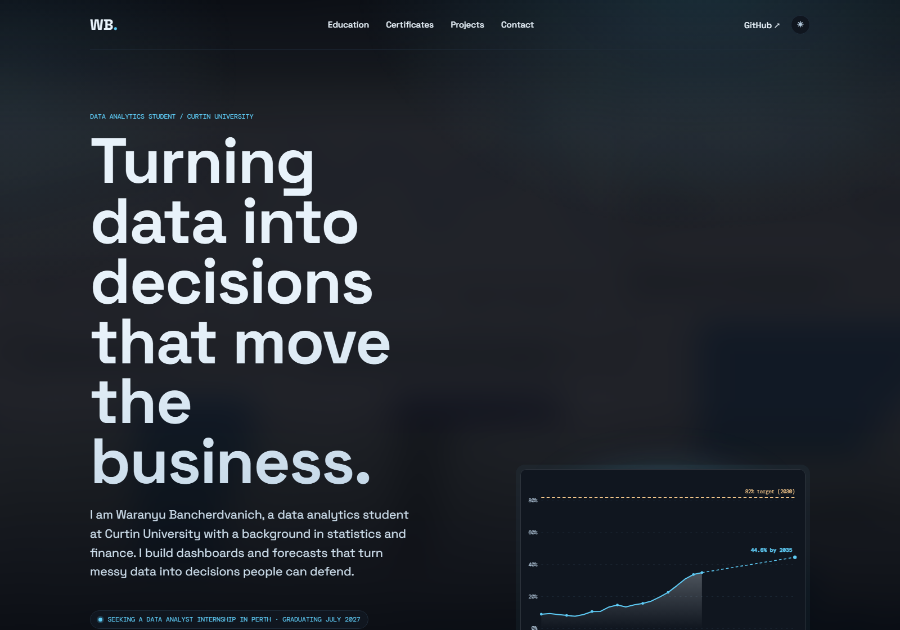
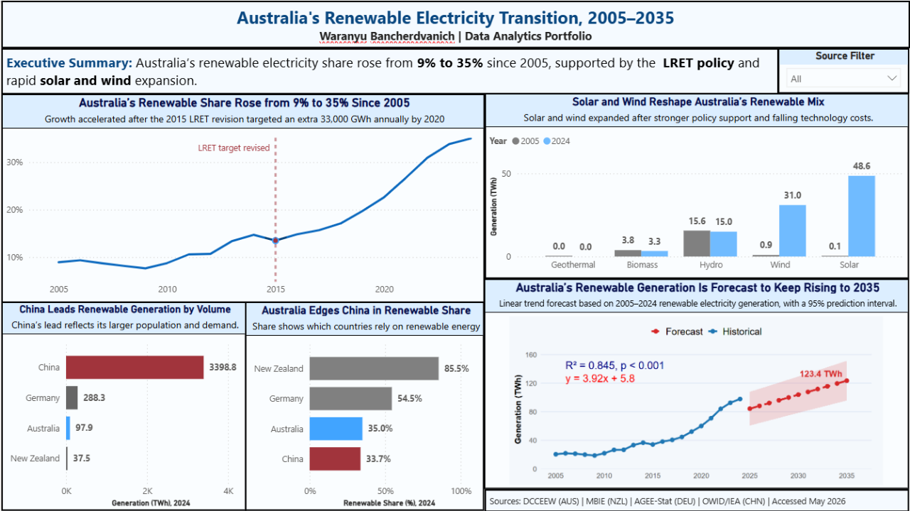
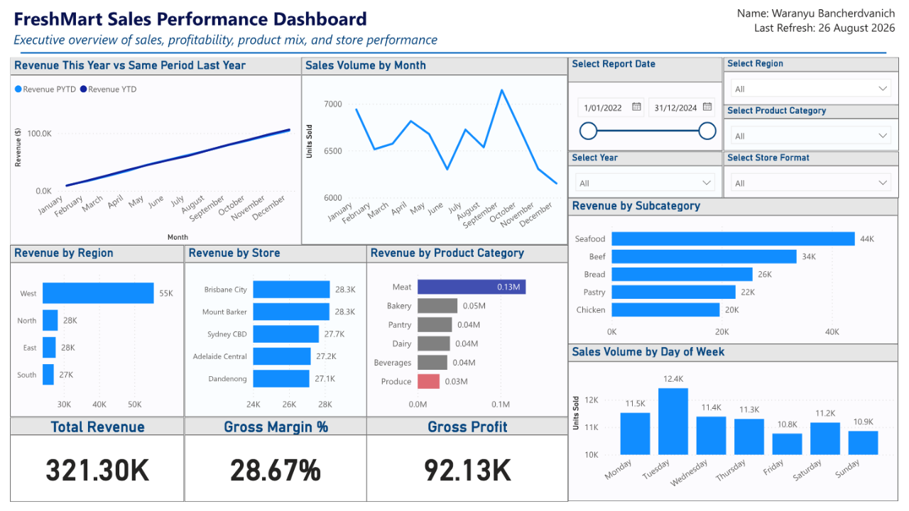
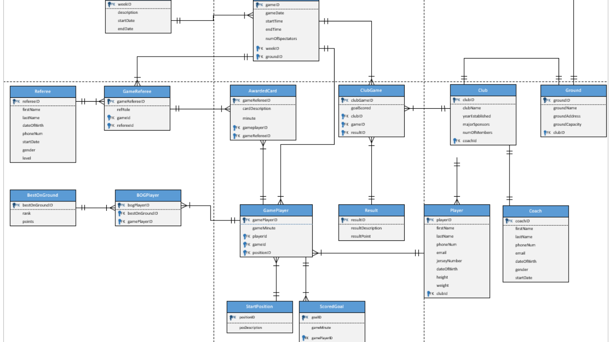
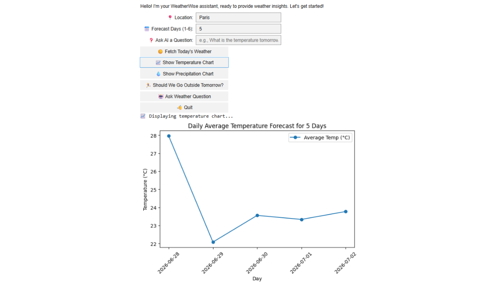

<h1 align="center">Hi, I'm JO 👋</h1>

  Data analyst working in BI and visualisation. 
  Master of Information Systems and Technology at Curtin University, with a background in statistics and finance. 
  I build dashboards, data models, and forecasts that turn messy data into decisions people can defend.

  
  
  

 

  

<h3 align="center"><a href="https://waranyu-cv.vercel.app">waranyu-cv.vercel.app</a></h3>

  My portfolio. Every project below has a full case study there, 
  with live charts and SQL queries you can run in the browser, not just screenshots.

---

## 🛠️ Tools

  
  
  
  
  
  
  

**Modelling:** ERD · normalisation · star and galaxy schema · time-series forecasting

---

## 📊 Featured projects

<table>
<tr>
<td width="50%" valign="top">

<h3>⚡ Australia's renewable transition</h3>

Traced Australia's renewable share from <b>9% in 2005 to 35% in 2024</b>, with solar alone growing from 0.1 to 48.6 TWh. An R linear regression forecasts <b>44.6% by 2035</b> (R² ≈ 0.85, p &lt; 0.001), well short of the 82%-by-2030 target. Benchmarked against Germany (54.5%) and New Zealand (85.5%).

<code>Power BI</code> <code>DAX</code> <code>R</code> <code>Forecasting</code>

  <a href="https://waranyu-cv.vercel.app/renewable.html"><b>Case study →</b></a> ·
  <a href="https://github.com/jo-bancherdvanich/renewable-electricity-dashboard">Repository</a>

</td>
<td width="50%" valign="top">

<h3>🛒 FreshMart data warehouse</h3>

Modelled <b>17,697 transactions</b> across 60 products, 12 stores, and 21 promotions into a Kimball star schema. Audited five source tables in Power Query: removed duplicate customers, collapsed 13 inconsistent category labels to 6, and remapped 93 rows with an unmatched customer ID. Delivered revenue, gross margin, and year-on-year views.

<code>Power BI</code> <code>Power Query</code> <code>DAX</code> <code>Star schema</code>

  <a href="https://waranyu-cv.vercel.app/freshmart.html"><b>Case study →</b></a> ·
  <a href="https://github.com/jo-bancherdvanich/freshmart-data-warehouse">Repository</a>

</td>
</tr>
<tr>
<td width="50%" valign="top">

<h3>⚽ Football club database</h3>

Designed a <b>16-table normalised schema</b> from 18 documented business rules, drew the ERD, then built and tested the Oracle tables for relational integrity. Wrote 7 analytical queries answering real questions: season ladder, top scorers, goals per ground, MVP rankings, and away form.

<code>Oracle SQL</code> <code>ERD</code> <code>Normalisation</code>

  <a href="https://waranyu-cv.vercel.app/football-database.html"><b>Case study →</b></a> ·
  <a href="https://github.com/jo-bancherdvanich/soccer-competition-database">Repository</a>

</td>
<td width="50%" valign="top">

<h3>🌦️ WeatherWise</h3>

An interactive weather advisor built in a Jupyter notebook. Pulls live conditions and 5-day forecasts from the OpenWeatherMap API, charts temperature and rainfall with Matplotlib and ipywidgets controls, parses plain-language questions, and caches responses to avoid repeat API calls.

<code>Python</code> <code>Matplotlib</code> <code>ipywidgets</code> <code>REST API</code>

  <a href="https://waranyu-cv.vercel.app/weatherwise.html"><b>Case study →</b></a> ·
  <a href="https://github.com/jo-bancherdvanich/Weatherwise_Waranyu.B">Repository</a>

</td>
</tr>
</table>

---

## 📫 Reach me

  
  
  

